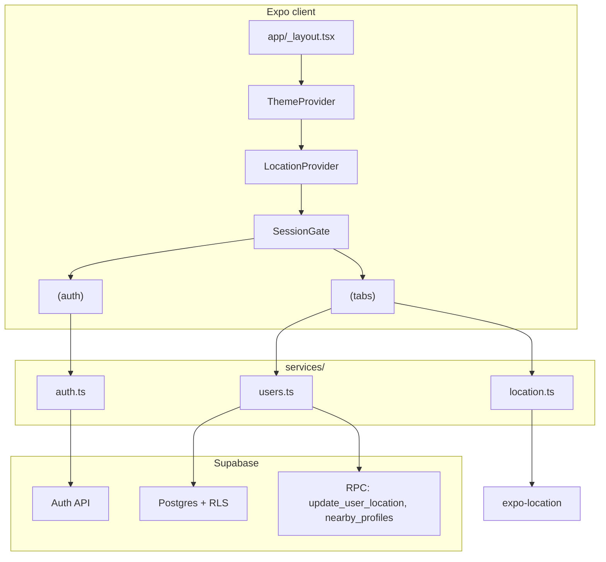

# Violet — architecture

Technical structure of the app: runtime layers, navigation, data access, and how pieces depend on each other. For step-by-step user journeys, see [USER-FLOWS.md](./USER-FLOWS.md).

---

## 1. High-level overview

Violet is an **Expo (React Native)** app using **Expo Router** for navigation. **Supabase** backs authentication and persistent profile/preferences; **Postgres RPCs** support location updates and nearby discovery. Several features (chats, cities, parts of profile) still use **in-app mock hooks** until backend parity exists.

---

## 2. Technology stack

| Layer | Choice |
|-------|--------|
| Runtime | Expo SDK 52, React 18.3, React Native 0.76 |
| Navigation | Expo Router (file-based routes, Stack + Tabs) |
| Auth & API | `@supabase/supabase-js` |
| Config | `EXPO_PUBLIC_SUPABASE_URL`, `EXPO_PUBLIC_SUPABASE_KEY` |
| Session (native) | AsyncStorage via Supabase client options in `config/supabase-config.ts` |
| Fonts | `@expo-google-fonts/inter` |
| Location | `expo-location` (`services/location.ts`, `contexts/location-context.tsx`) |

---

## 3. Entry point and global composition

**File:** `app/_layout.tsx`

| Step | What happens |
|------|----------------|
| Splash | `SplashScreen.preventAutoHideAsync()` until fonts load or error |
| Fonts | `useFonts` (Inter variants) |
| Providers | `ThemeProvider` → `LocationProvider` |
| Auth shell | `SessionGate` renders root `Stack` and redirects based on Supabase session |
| Status bar | `StatusBar` from `expo-status-bar` |

### SessionGate (auth routing)

- Reads `getSession()` once, subscribes to `onAuthStateChange`.
- **Session + not in `(tabs)`** → `router.replace('/(tabs)')`.
- **No session + not in `(auth)`** → `router.replace('/(auth)/login')`.
- Root stack screens: `(auth)`, `(tabs)`, `+not-found`.

### Dead / unused in shell

- **`contexts/AuthContext.tsx`**: mock `AuthProvider` / `useAuth`; **not** wrapped in root layout and **not** imported elsewhere. Real auth is **only** Supabase + `SessionGate`.

---

## 4. Navigation structure (file routes)

### Root stack

| Segment | Layout | Purpose |
|---------|--------|---------|
| `(auth)` | `app/(auth)/_layout.tsx` — Stack | Login, signup, auth index |
| `(tabs)` | `app/(tabs)/_layout.tsx` — Tabs | Main app: Browse, Explore, Chats, Profile, Settings |
| `+not-found` | — | Unknown URLs |

### Tab order (`app/(tabs)/_layout.tsx`)

`index` (Browse) → `explore` → `chats` → `profile` → `settings`

### Modal / stack screens outside tabs

| Path | Notes |
|------|--------|
| `app/chat/[id].tsx` | Chat thread |
| `app/profile/[id].tsx` | External profile view |
| `app/preferences/*.tsx` | Preference subflows |

---

## 5. Services layer

### `config/supabase-config.ts`

Singleton `createClient` with RN URL polyfill, AsyncStorage on native, `persistSession`, `autoRefreshToken`.

### `services/auth.ts`

| Function | Supabase call |
|----------|----------------|
| `registerAuthUser` | `auth.signUp` |
| `loginAuthUser` | `auth.signInWithPassword` |
| `getCurrentUserSession` | `auth.getSession` |
| `logoutAuthUser` | `auth.signOut` |

### `services/users.ts`

| Function | Mechanism |
|----------|-----------|
| `createUserProfile` | `insert` → `user_profiles` |
| `createUserPreferences` | `insert` → `user_preferences` |
| `getCurrentUserProfile` | `select` on `user_profiles` where `id` = session user |
| `updateCurrentUserLocation` | RPC `update_user_location` |
| `getNearbyProfiles` | RPC `nearby_profiles` |

**Implementation note:** `updateCurrentUserLocation` exists but is **not** called from Browse in the current codebase; discovery reads coords client-side and calls `nearby_profiles`. Whether the DB needs a separate write path depends on your RPC/schema design.

### `services/location.ts`

Foreground permission helpers and `getCurrentPositionAsync` (balanced accuracy).

### `services/api.ts`

Stub `fetchNearbyProfiles` to a placeholder URL — **not** used by Browse (Browse uses `getNearbyProfiles` in `users.ts`).

### `services/chat.ts`

| Function | Mechanism |
|----------|-----------|
| `listConversationSummaries` | RPC `list_conversation_summaries` → inbox rows mapped to `Chat` |
| `getOrCreateDm` | RPC `get_or_create_dm` → conversation UUID for two users |
| `fetchMessages` / `sendChatMessage` | `messages` table `select` / `insert` |
| `markConversationRead` | RPC `mark_conversation_read` |
| `fetchConversationMeta` | `conversation_participants` + `user_profiles` for header |

Hooks: `hooks/useChats.ts` (inbox + refetch on focus), `hooks/useChatMessages.ts` (thread + Realtime channel).

---

## 6. Contexts and reusable gates

| Module | Responsibility |
|--------|----------------|
| `contexts/ThemeContext.tsx` | Light/dark palette, `toggleTheme`, `colors` |
| `contexts/location-context.tsx` | `coords`, `permissionStatus`, `isLoading`, `error`, `refreshLocation`, `requestLocationPermission` |
| `components/location/location-gate.tsx` | Declarative UI for loading / denied / error / children — **optional**; not mounted in root layout today |

---

## 7. Types and mock data layer

| Area | Location |
|------|----------|
| Domain types | `types/user.ts`, `types/chat.ts`, `types/message.ts`, `types/location.ts` |
| Mock hooks | `hooks/useMockUsers.ts`, `useMockChats.ts`, `useMockChatMessages.ts`, `useMockBotMessages.ts`, `useMockCities.ts` |

Mocks exist for **Explore (cities)** and other legacy UI; **live DMs** use Supabase once the chat migration is applied (`useChats` / `useChatMessages`). Older `useMockChats` / `useMockChatMessages` hooks remain in the repo but are not used by the tab screens.

---

## 8. Supabase contract (what the client assumes)

**Tables (referenced in TS):**

- `user_profiles`
- `user_preferences`

**RPCs:**

- `update_user_location(current_user_id, user_lat, user_lng)`
- `nearby_profiles(user_lat, user_lng, current_user_id)`
- `get_or_create_dm(other_user_id)`
- `list_conversation_summaries()`
- `mark_conversation_read(p_conversation_id)`

**Chat tables (after migration):**

- `conversations`, `conversation_participants`, `messages`

RLS and grants must allow authenticated users to perform these operations as intended; failures surface as thrown errors or empty results in UI.

---

## 9. Security architecture (client-side view)

- Only the **anon** key ships in the app (`EXPO_PUBLIC_*`).
- Authorization boundaries are **Supabase Auth JWT** + **RLS** + **RPC** definitions — not obscurity in the client.
- **Service role** must never be embedded in the mobile app.
- Location: handled in-process; persistence policy is defined by `update_user_location` and related tables (not all client-visible).

---

## 10. Key file index

| Path | Role |
|------|------|
| `app/_layout.tsx` | Fonts, providers, session redirect |
| `app/(tabs)/_layout.tsx` | Tab bar |
| `app/(tabs)/index.tsx` | Browse + Supabase nearby |
| `app/(auth)/login.tsx` / `signup.tsx` | Auth screens |
| `services/auth.ts` | Auth wrappers |
| `services/users.ts` | Profile, prefs, RPCs |
| `services/location.ts` | Expo Location |
| `contexts/location-context.tsx` | App-wide location state |

---

## 11. Maintaining this doc

Update when you: add routes, change provider order, introduce new services or RPCs, replace mocks with Supabase, or change env var names.
